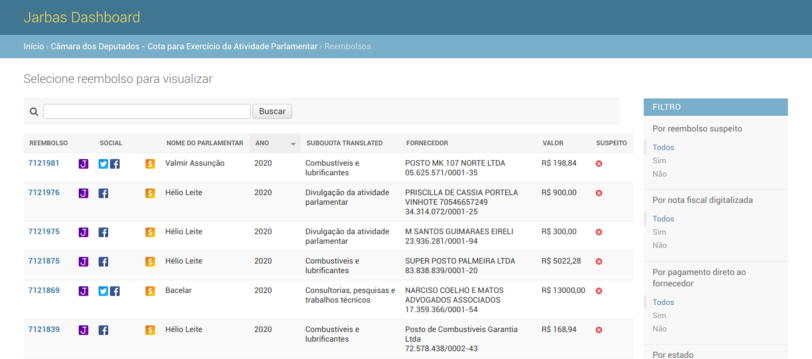
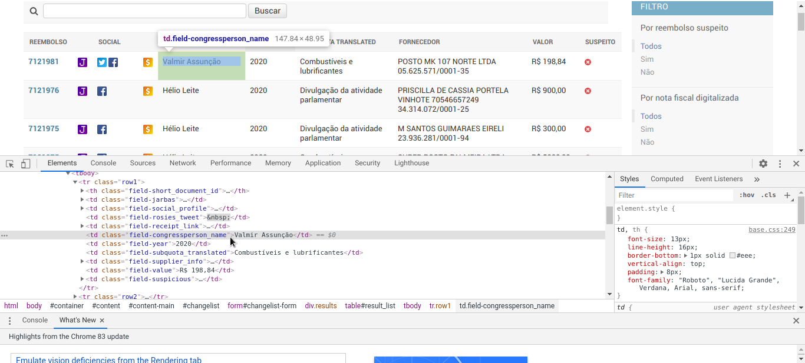
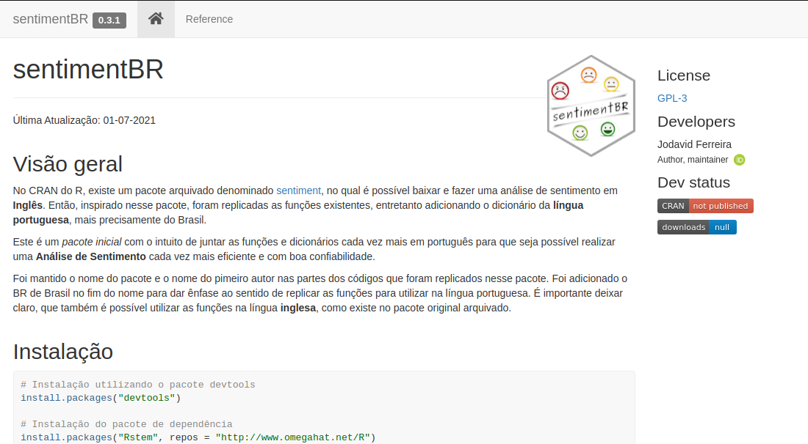

layout: true

<div class="my-footer"><span>

<a href="http://jodavid.github.io">Jodavid Ferreira</a> - e-mail: <a href="mailto:jodavid@protonmail.com">jodavid@protonmail.com</a> |
LinkedIn: <a href="https://www.linkedin.com/in/jodavidferreira/">jodavidferreira</a>

</span></div>


---


```{r setup, include=FALSE}
options(htmltools.dir.version = FALSE,width = 500)

knitr::opts_chunk$set(fig.align = "center", message=FALSE, warning=FALSE, cache = TRUE)
```

<br/>
# O que é Web Scraping?

<br/>
* O **Web Scraping** é uma área da **Text Mining (Mineração de Texto)** ;


<br/><br/>
### O que é Mineração de Texto?

Segundo o Livro '`Text Mining in Practice with R`':

<br/>
*  "Mineração de texto é o processo de **destilar**<sup>1</sup> **insights** de texto".


.footnote[
[1] A destilação é uma técnica de separação.
]

---

### Onde a mineração de texto se encaixa?

<br/>
* Para **acadêmicos**, pode auxiliar na compreensão de transcrições qualitativas ou em um estudo da linguagem;

<br/>
* Para **empresas**, pode render informações interessantes que auxiliarão na modelagem preditiva por exemplo;

<br/>
* Aos **profissionais de marketing**, podem auxiliar na criação de textos, fornecendo recomendações precisas para sua organização.
<!--isso porque através de análises de textos externos, eles podem criar os seus fornecendo recomendações precisas para sua organização.-->

<br/>
* Então, a **mineração de texto** pode ser usada em qualquer decisão baseada em dados, onde o texto se encaixa naturalmente como uma entrada.


---

# Pacote `rvest`

<br/>
<br/>

```{r, echo = FALSE, out.width="20%", fig.cap="<center><b>Logo - rvest </center></b>"}
knitr::include_graphics("https://raw.githubusercontent.com/tidyverse/rvest/master/man/figures/logo.png")
```

<br/>


`rvest` ajuda você a extrair (ou colher) dados de páginas da web.

Ele foi projetado para funcionar com *magrittr* (pacote responsável pelo operador pipe *%>%*) para facilitar a expressão de tarefas comuns de web scraping, inspiradas em bibliotecas como a `beautiful soup` e `RoboBrowser`.

<!--
Se você estiver copiando várias páginas, recomendo fortemente o uso de rvest em conjunto com educado. O pacote educado garante que você respeite o robots.txt e não martele o site com muitas solicitações.
-->

---

# O que é HTML e CSS ?

* **HTML** (HyperText Markup Language - Linguagem de Marcação de Hipertexto) - é uma linguagem de marcação usada para estruturar uma página web.

* **CSS** (Cascading Style Sheets - Folha de Estilo em Cascata) - é usado para estilizar os elementos escritos no *HTML*.


### O que precisamos saber ?

Em **HTML** e **CSS**, existe a possibilidade de aplicar estilos através de 'class' e 'id';


* **HTML** : 
 * *class* : é o atributo global formado por uma lista das classes de um elemento, separada por espaços.
<!-- Classes permitem a CSS e Javascript selecionar e acessar elementos específicos através dos seletores de classe ou funções como o método DOM. -->
  * *id* : define um identificador exclusivo (ID) que deve ser único por todo o documento.
<!--Seu objetivo é identificar o elemento ao navegar por âncoras (usando um identificador de fragmento), quando utilizar scripts ou estilizando (com CSS).-->

* **CSS**: usado para personalizar a parte visual dos sites.

---

# Instalando o `rvest`

<br/>
Instalando o `rvest` através do `devtools`

<br/>
```{r eval=FALSE}
install.packages("devtools")
library(devtools)
devtools::install_github("tidyverse/rvest")
```

<br/>
<br/>
Lendo o pacote:

<br/>
```{r}
library(rvest)
```

---

## Exemplo 1: Extraindo informações do site Jarbas

### Projeto Serenata de Amor

O estudo será realizado sobre o projeto “SERENATA DE AMOR” [https://serenata.ai/](https://serenata.ai/), que é um projeto aberto no qual usa data science (ciência de dados) - a mesma tecnolgia usada por gigantes como Google, Facebook e Netflix - com o objetivo de monitorar os gastos públicos e compartilhar informações de forma acessível a todos.


* Jarbas - [https://jarbas.serenata.ai/dashboard/chamber_of_deputies/reimbursement/](https://jarbas.serenata.ai/dashboard/chamber_of_deputies/reimbursement/)


```{r, echo = FALSE, out.width="100%", fig.cap="<center><b>site Jarbas </center></b>"}

```


---

## Exemplo 1: Extraindo informações do site Jarbas

### Passo 1: Lendo a URL

Usando a função `read_html` do pacote `xml2` (este pacote é uma dependência do `rvest`) para ler a url.

```{r}
library(rvest)

url <- "https://jarbas.serenata.ai/dashboard/chamber_of_deputies/reimbursement/"
jarbas_webpage <- read_html(url)
```

---


## Exemplo 1: Extraindo informações do site Jarbas

### Passo 2: Extrair dados de classes do CSS

Class: *.field-congressperson_name*

```{r, echo = FALSE, out.width="100%", fig.cap="<center><b>class:  .field-congressperson_name </center></b>"}

```

---


## Exemplo 1: Extraindo informações do site Jarbas

### Passo 2:


Duas funções serão utilizadas aqui:

1. *html_nodes*: Use esta função para extrair os nós que desejamos (neste caso nós com ".field-congressperson_name" como classe css)
2. *html_text*: Use esta função para extrair o texto dos nós html (neste caso, os nomes de nossos representantes)

```{r, size="huge"}
#Scraping  usando classe css ‘field-congressperson_name’
jarbas_names_html <-html_nodes(jarbas_webpage, '.field-congressperson_name')
jarbas_names <- html_text(jarbas_names_html)
head(jarbas_names,3)
```

---

## Exemplo 1: Extraindo informações do site Jarbas

### Passo 2:


```{r}
#SUBQUOTA TRANSLATED
jarbas_subquota_html <-html_nodes(jarbas_webpage, '.field-subquota_translated')
jarbas_subquota <- html_text(jarbas_subquota_html)
head(jarbas_subquota,3)

#Fornecedor
jarbas_provider_html <-html_nodes(jarbas_webpage, '.field-supplier_info')
jarbas_provider <- html_text(jarbas_provider_html)
head(jarbas_provider,3)

#Valores em Real
jarbas_value_html <-html_nodes(jarbas_webpage, '.field-value')
jarbas_value <- html_text(jarbas_value_html)
head(jarbas_value,3)

```

---

## Exemplo 1: Extraindo informações do site Jarbas

### Passo 2:

A seguir serão mostrados o valor do reembolso, eles são extraídos
em tipo de variável caracter: Ex: R$ 139,76, R$ 40,23.
Entretanto, como desejamos manipular esses números, precisamos convertê-los para tipo de variável numérica, dessa forma será utilizado a biblioteca: "*stringr*" mais especificamente a função: `str_extract`. Segue o script para conversão da variável.

```{r}
library(stringr)
#Conversão para tipo numérico
jarbas_value <- as.numeric(sub(",",".",
                str_extract(jarbas_value,pattern = "\\-*\\d+,\\s{0,}\\d+")))
head(jarbas_value,3)
```

---

## Exemplo 1: Extraindo informações do site Jarbas

### Passo 3: Geração de data.frame

```{r}
#Combinando todas as características obtidas
jarbas_names <- str_extract(jarbas_names,pattern = boundary("word"))
jarbas_df <- data.frame(
  Name = jarbas_names,
  Subquota = jarbas_subquota,
  Provider = jarbas_provider,
  Value = jarbas_value
  )

#Mostrando tipo das variáveis
str(jarbas_df)
```

---

## Exemplo 1: Extraindo informações do site Jarbas

### Passo 4: Geração de um gráfico

Foram utilizados as 50 primeiras linhas do data.frame e uma biblioteca *ggplot2* para geração do gráfico.

```{r, eval = F}
library(ggplot2)

jarbas_df <- jarbas_df[1:50,]

ggplot(
  jarbas_df, aes(Value,Name,colour=Subquota)) +
  geom_point() +
  labs(title="", x ="pedidos de reembolso (R$)",
       y = "deputados",colour="SUBQUOTA TRANSLATED")
```


---

```{r, fig.width=15,echo=F}
library(ggplot2)

jarbas_df <- jarbas_df[1:50,]

ggplot(
  jarbas_df, aes(Value,Name,colour=Subquota)) +
  geom_point() +
  labs(title="", x ="pedidos de reembolso (R$)",
       y = "deputados",colour="SUBQUOTA TRANSLATED")
```

---

## Exemplo 2: Texto de um WebSite

Neste segundo exemplo vamos obter o texto de um site e analisá-lo.


* Site El País (categoria de Tecnologia) - [https://brasil.elpais.com/brasil/2021-01-26/todos-os-brasileiros-estao-com-seus-dados-a-venda-e-ha-muito-pouco-o-que-se-pode-fazer-para-se-proteger.html](https://brasil.elpais.com/brasil/2021-01-26/todos-os-brasileiros-estao-com-seus-dados-a-venda-e-ha-muito-pouco-o-que-se-pode-fazer-para-se-proteger.html)


```{r, echo = FALSE, out.width="100%", fig.cap="<center><b>site ElPaís </center></b>"}

```

---

## Exemplo 2: Texto de Site

### Passo 1: Lendo a URL

```{r}
library(rvest)

url <- "https://brasil.elpais.com/brasil/2021-01-26/todos-os-brasileiros-estao-com-seus-dados-a-venda-e-ha-muito-pouco-o-que-se-pode-fazer-para-se-proteger.html"
webpage <- read_html(url)
```


### Passo 2: Extraindo texto de Site
  
```{r, size="huge"}
# Passo 2:
#Scraping  usando ‘p’
names_html <-html_nodes(webpage, 'p')
names <- html_text(names_html)
head(names)
```

---


## Exemplo 2: Texto de Site
  
### Passo 3: Preparação dos dados

Organizando os dados para geração do gráfico da Nuvem de Tags

* `Corpus`: função que transforma vetores/listas em coleções de documentos que contêm texto.

```{r}

# Início do código para Nuvem de palavras
library(tm)

# -------
# Colocando as palavras em minusculos
# -------
texto <- tolower(names)
# -------
# Removendo as stopwords
texto <- removeWords(texto, stopwords(kind = "portuguese"))
# -------
```

---

### Passo 3: Preparação dos dados - cont.

```{r}
# Transformando em formato Corpus
texto <- Corpus(VectorSource(texto),
                readerControl = list(reader = reader(VectorSource(texto)),
                                     language = "pt"))
# -------
# Removendo as stopwords de arquivo.txt
# -------
file <- url("https://jodavid.github.io/Slide-Introdu-o-a-Web-Scrapping-com-rvest/stopwords_pt_BR.txt")
stopwords_ptBR <- read.table(file)
stopwords_ptBR <- unlist(stopwords_ptBR, use.names = FALSE)
texto <- tm_map(texto, removeWords, stopwords_ptBR)

# -------
# Descobrindo tamanho da lista
n <- length(texto)
# -------
# Removendo pontuacao
for(i in 1:n)
  {
    # Remover pontuacao, preservando abreviacoes
    texto[[i]] <- removePunctuation(texto[[i]],
                                    preserve_intra_word_contractions = TRUE,
                                    preserve_intra_word_dashes = TRUE)
    # Removendo quotations
    texto[[i]] <- stringr::str_replace_all(texto[[i]], setNames(c('','','',''), c('“ ', '“',' ”','”')))
  }
# -------
```

---

### Passo 4: Geração de um gráfico de Nuvem de Tags
  
Foram utilizados o data.frame e uma biblioteca *ggplot2* para geração do gráfico.


```{r eval=FALSE}
library(wordcloud)
library(yarrr)

wordcloud(words = texto, min.freq = 2, random.order = TRUE,
          colors = yarrr::piratepal("basel"), use.r.layout = TRUE, rot.per = 0.5)
```

---

```{r echo=FALSE}
library(wordcloud)
library(yarrr)

wordcloud(words = texto, min.freq = 2, random.order = TRUE,
          colors = yarrr::piratepal("basel"), use.r.layout = TRUE, rot.per = 0.5)
```


---


## Extra: Frequência das palavras


```{r}
#' -------
#' Transformando o arquivo 'texto' que estava no tipo Corpus para Data.frame
#' -------
textodataframe <- data.frame(text = sapply(texto, as.character),
                             stringsAsFactors = FALSE)
textodataframe <- textodataframe[-which(textodataframe ==""),]

#' --------------
#' Frequencia das palavras
#' --------------
frequencia_palavras <- table( textodataframe )
frequencia_ordenada_palavras <- sort( frequencia_palavras, decreasing=TRUE)
palavras <- data.frame(frequencia_ordenada_palavras)

head(palavras,6)

```

---

## Extra: Análise de Sentimentos

**Análise de sentimentos** é a tarefa de identificar se a opinião que foi expressada em um determinado texto, é positiva ou negativa. 

Na **análise de sentimento** o grande problema a ser resolvido, é a classificação do texto que está sendo analisado. A classificação consiste no processo de encontrar, através de *Machine Learning*, um modelo ou função que descreva diferentes classes de dados.

```{r, echo = FALSE, out.width="55%", fig.cap="<center><b>Análise de Sentimento</center></b>"}
knitr::include_graphics("https://binds.co/img/section/faces-sentiment.png")
```

Fonte: [https://binds.co/img/section/faces-sentiment.png](https://binds.co/img/section/faces-sentiment.png)

---

## Extra: Análise de Sentimentos

Uma das formas mais antigas para tratar desse problema é por meio do algoritmo de Naive Bayes que é um classificador probabilístico, e parte da premissa que há independência entre as características (variáveis - features) de um modelo, uu seja, ele recebe o nome de “naive” (ingênuo) porque desconsidera a correlação entre as variáveis (features).

Post: [https://jodavid.github.io/post/2021-06-06-scraping-de-texto-com-an%C3%A1lise-de-sentimento-em-r/](https://jodavid.github.io/post/2021-06-06-scraping-de-texto-com-an%C3%A1lise-de-sentimento-em-r/)


```{r, echo = FALSE, out.width="75%", fig.cap="<center><b>sentimentBR</center></b>"}

```

---

# Pacote `sentimentBR`

<br/>
<br/>

```{r, echo = FALSE, out.width="20%", fig.cap="<center><b>Logo - sentimentBR </center></b>"}
knitr::include_graphics("https://jodavid.github.io/sentimentBR/reference/figures/logo.png")
```

<br/>

Link: [https://jodavid.github.io/sentimentBR/](https://jodavid.github.io/sentimentBR/)

Este é um pacote inicial com o intuito de juntar as funções e dicionários cada vez mais em português para que seja possível realizar uma **Análise de Sentimento** cada vez mais eficiente e com boa confiabilidade.

---

# Instalando o `sentimentBR`

```{r eval=FALSE}
# Instalação utilizando o pacote devtools
install.packages("devtools")

# Instalação do pacote de dependência
install.packages("Rstem", repos = "http://www.omegahat.net/R")

# Instação do pacote sentimentBR
devtools::install_github("jodavid/sentimentBR")
```

Lendo o pacote

```{r eval=FALSE}
# Lendo o pacote
library(sentimentBR)
```

---

## Extra: Análise de Sentimentos

A Classificação será feita no DataFrame das frases,
vamos retornar a matriz:

A matriz de dados está nomeada como `texto` no slide 17.

```{r}

# -------
# Pacotes Necessários
library(sentimentBR)
library(lexiconPT)
# -------

# -------
# Transformando o arquivo 'texto' que estava no tipo Corpus para Data.frame
textodataframe <- data.frame(text = sapply(texto, as.character), stringsAsFactors = FALSE)
# -------

```

---

## Extra: Análise de Sentimentos

Usando a função classify_emotion para classificar as emoções. É possível obter seis níveis de emoções: **RAIVA, DESGOSTO, MEDO, ALEGRIA, TRISTEZA, SURPRESA, CONFIANÇA, POSITIVA, NEGATIVA, ANTECIPAÇÃO**.

```{r out.width=.5}

# -------
# Classificando as emocoes de cada paragrafo
emotions <- classify_emotion(textColumns = textodataframe, algorithm = 'bayes', lang = "pt")
emotions

```

---

## Extra: Análise de Sentimentos


```{r out.width=.5}

# -------
# Quantos Parágrafos
nrow(emotions)

# -------
# Tabela das classificações
table(emotions[,11])

```

Calculando as Polaridades

```{r}

# -------
# Classificando a polaridade de cada paragrafi
polarities <- classify_polarity(textColumns = textodataframe, algorithm = "bayes")
head(polarities,1)

```

---

## Extra: Análise de Sentimentos

Neste caso também a classificação é obtida na última coluna denominada de `BEST_FIT`.

```{r}
# -------
# Transformando os resultados em data.frame
df <- data.frame(paragrafos = textodataframe,
                 emocoes = emotions[,'BEST_FIT'],
                 polaridades = polarities[,'BEST_FIT'])
# Transformando os 'NA' em 'N.A.'
df[is.na(df)] <- "N.A."
# -------

```

---

### Criando um gráfico de Barras com as polaridades

```{r fig.width=7, fig.height=4}
# -------
# Pacote Necessário
library(ggplot2)
# -------
ggplot(df, aes(polaridades,fill=polaridades)) +
  geom_bar() +
  labs(title="", x ="Polaridades",
       y = "Quantidades") + 
  theme_minimal()
```

---


### Criando um gráfico de Barras e Setores com 'emocoes'

```{r fig.width=7, fig.height=4}
# -------
ggplot(df, aes(emocoes,fill=emocoes)) +
  geom_bar() +
  labs(title="", x ="Emoções",
       y = "Quantidades") + 
  theme_minimal()
```

---

## Gráfico de Nuvem de tags com polaridades

```{r}
# -------
# Pacote Necessário
library(dplyr)
# -------
# Dividindo o texto nas polaridades
polaridades_cat <- unique(df$polaridades)
# -------
df2 <- t( sapply(1:length(polaridades_cat),function(i){
        polaridade <- summarise(df,
                                texto2 = paste(df$text[which(df$polaridades==polaridades_cat[i])],
                                               collapse = " "));
  
  return(c(polaridades = polaridades_cat[i],
         pasted = c(polaridade$texto2)))
}) )
# -------
corpus <- Corpus(VectorSource(df2[,2]))
corpus <- tm_map(corpus, removeNumbers)
tdm <- TermDocumentMatrix(corpus)
tdm <- as.matrix(tdm)
colnames(tdm) <- unique(df2[,1])
# -------
```

---

## Gráfico de Nuvem de tags com polaridades

```{r fig.width=7, fig.height=4}
# -------
# Gerando Gráfico
comparison.cloud(tdm,
                 colors = yarrr::piratepal("basel"),
                 scale = c(3,.5),random.order = F)
```

---


# Script R 

Segue abaixo o link para o Script **R** ulitizado:

[Script R - Clique Aqui!](https://raw.githubusercontent.com/Jodavid/Slide-Introdu-o-a-Web-Scrapping-com-rvest/master/Script%20-%20Introducao-.R)


# Fontes

* Slide produzido com Rmarkdown, com template
`Xaringan`: [https://github.com/yihui/xaringan](https://github.com/yihui/xaringan).

* Livro: `Text Mining in Practice with R`;

* [https://github.com/tidyverse/rvest](https://github.com/tidyverse/rvest)

* [https://brasil.elpais.com/brasil/2021-01-26/todos-os-brasileiros-estao-com-seus-dados-a-venda-e-ha-muito-pouco-o-que-se-pode-fazer-para-se-proteger.html](https://brasil.elpais.com/brasil/2021-01-26/todos-os-brasileiros-estao-com-seus-dados-a-venda-e-ha-muito-pouco-o-que-se-pode-fazer-para-se-proteger.html)

* [http://www.cienciaedados.com/analise-de-sentimentos-e-machine-learning/#:~:text=An%C3%A1lise%20de%20sentimentos%20%C3%A9%20a,texto%2C%20%C3%A9%20positiva%20ou%20negativa.](http://www.cienciaedados.com/analise-de-sentimentos-e-machine-learning/#:~:text=An%C3%A1lise%20de%20sentimentos%20%C3%A9%20a,texto%2C%20%C3%A9%20positiva%20ou%20negativa.)
